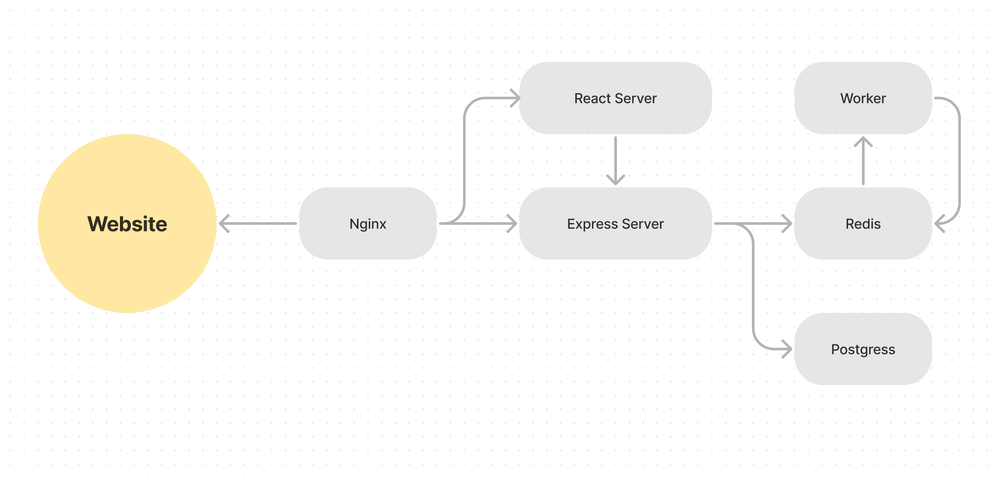

### Start Development Server
1. Build and run the container
    ```bash
    docker-compose up --build
    ```

2. Test the project on `localhost:3050`

### Project Containers Architecture

<p align="center"></p>